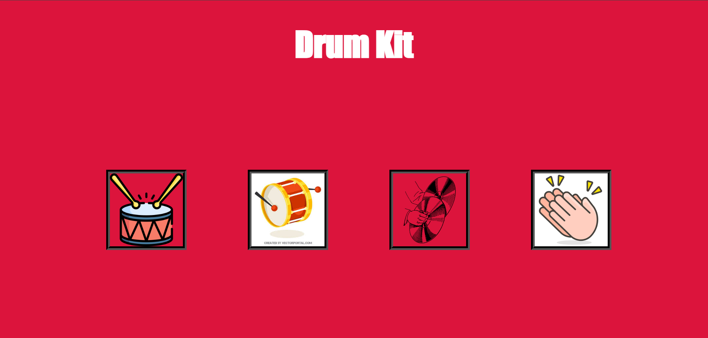

# Mason Cuchia's Portfolio
 
## About Me
I started off my college career at Eastern New Mexico University, where I played division 2 baseball my freshman year. After that I transfered to Texas State University where I will attend my upcoming sophmore year. There I will pursue a degree in Computer Science and I will graduate in 2027.  

## Projects

### Project 1

#### Description:
 This project is a text based adveture game I made using python. I learned python in my computer science intro class so I used the skills I learned to make a game during winter break. 

#### Link 
https://github.com/MasonCuchia/github-portfolio/blob/main/Woods_Of_Shadows.py 

### Project 2

#### Description:
 This project is a copy of the game "Buckshot Roulette" I made using python. I made this project after I saw YouTube videos of people playing the game online and I wanted to see if I could recreate it on my own using python.

#### Link 
https://github.com/MasonCuchia/github-portfolio/blob/main/Roulette-Game/Roulette.py

### Project 3

#### Description:
 This project is a basic drum kit using HTML, CSS, and JavaScript. When you click on the images they make the corresponding sounds. I made this project to showcase my basic skills using these three languages.

#### Link 
https://github.com/MasonCuchia/github-portfolio/tree/main/Drum%20Kit

 #### Preview

## Contact Me 

#### Email
masoncuchia@gmail.com